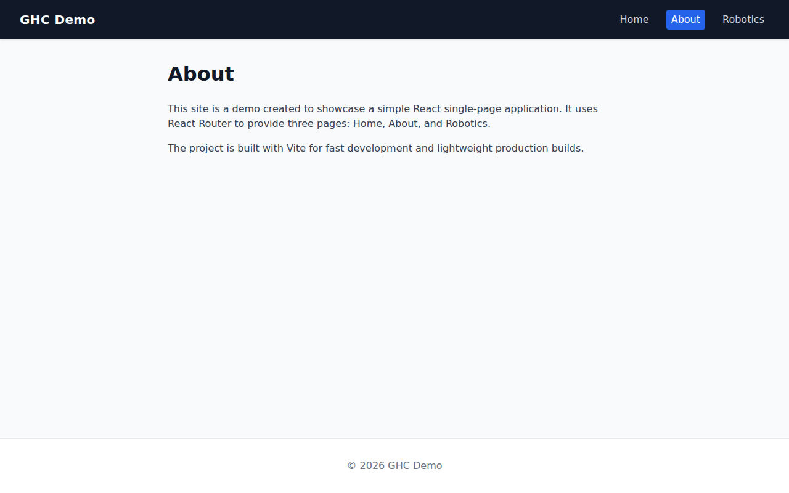

# gh-coding-agent

A small React website built with Vite and React Router. It has three pages:
**Home**, **About**, and **Robotics**.

## Getting started

```bash
npm install
npm run dev      # start the dev server
npm run build    # produce a production build in dist/
npm run preview  # preview the production build
```

## Screenshots

| Home | About | Robotics |
| --- | --- | --- |
|  |  |  |
